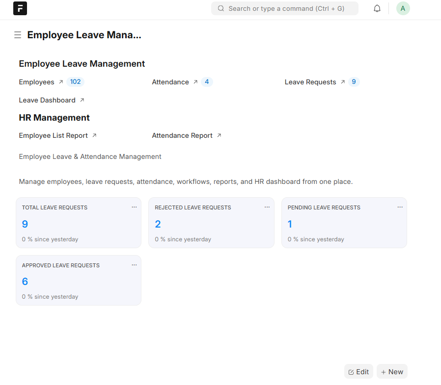
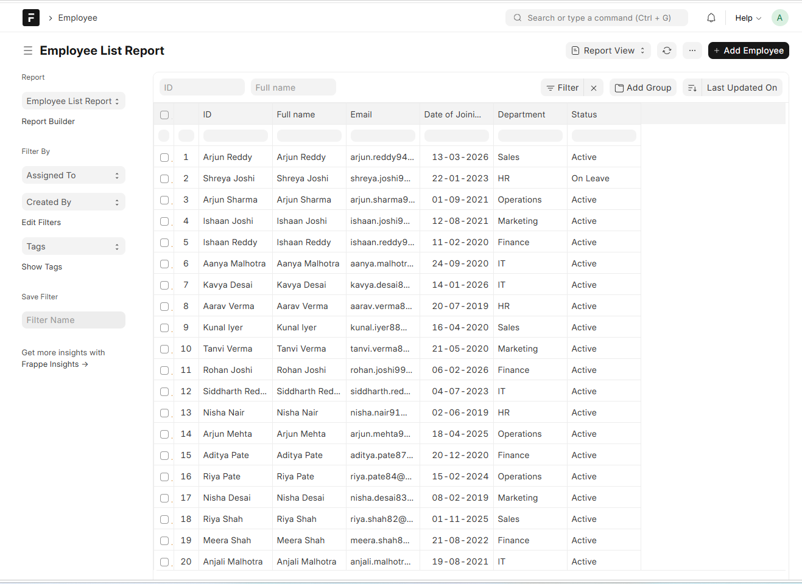
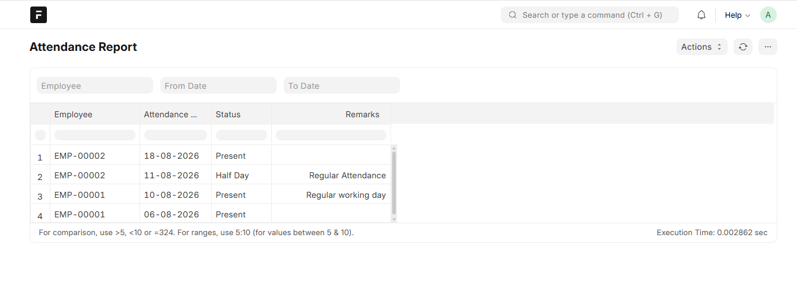

# Employee Leave & Attendance Management

## Project Overview

Employee Leave & Attendance Management is a custom HR management application built using the Frappe Framework.

The system is designed to manage employee information, attendance, leave requests, approval workflows, HR reports, and dashboards from a single workspace.

This project was developed as a hands-on learning project to understand how Frappe can be customized into a practical business application.

## Features

* Employee management
* Bulk employee import using CSV
* Department-wise employee organization
* Attendance management
* Leave request management
* Leave approval and rejection workflow
* Employee and HR Manager roles
* Role-based permissions
* Leave dashboard with KPI cards
* Attendance Report
* Employee List Report
* Custom Employee Leave Management workspace
* Phone number and employee contact management

## Departments

The project currently includes:

* HR
* IT
* Finance
* Sales
* Marketing
* Operations

## Main Modules

### Employee Management

The Employee module stores information such as:

* Full Name
* Email
* Phone
* Gender
* Date of Birth
* Employment Type
* Salary
* Probation Period
* Designation
* Date of Joining
* Department
* Status
* Address
* Notes

The project contains more than 100 employee records for realistic testing.

### Attendance Management

Attendance records can be created and viewed through the Attendance module.

The custom Attendance Report contains:

* Employee
* Attendance Date
* Status
* Remarks

### Leave Management

Employees can submit leave requests using the Leave Request module.

The workflow supports:

**Pending → Approved**

and

**Pending → Rejected**

The dashboard provides a quick view of current leave activity.

## Dashboard

### Workspace



### Employee List



### Attendance Report



The Employee Leave Management dashboard contains KPI cards for:

* Total Leave Requests
* Approved Leave Requests
* Rejected Leave Requests
* Pending Leave Requests

It also provides visual information such as:

* Leave Requests by Status
* Employees by Department

## Roles and Permissions

The project includes role-based access control.

### Employee

Employees can access relevant employee, attendance, and leave information according to their permissions.

### HR Manager

HR Managers have broader access to:

* Employees
* Attendance
* Leave Requests
* Reports
* HR dashboard

Permissions were tested to ensure that the application behaves differently according to the assigned role.

## Workspace

A custom **Employee Leave Management** workspace was created to provide centralized navigation.

The workspace includes:

* Employees
* Attendance
* Leave Requests
* Leave Dashboard
* Attendance Report
* Employee List Report
* HR Management section
* KPI cards
* Project description

## Data Import

More than 100 employee records were added using Frappe's Data Import functionality instead of manually entering each employee.

The import process was also used to update employee phone numbers while preserving existing employee records.

## Technology Used
## Installation & Usage

This project is a custom Frappe application.

### Prerequisites

Before installing the application, make sure you have:

- Ubuntu/Linux environment
- Python
- MariaDB
- Redis
- Node.js
- Frappe Bench
- A Frappe site

### Installation

Clone the repository inside your Frappe Bench:

```bash
cd ~/frappe-bench

git clone <https://github.com/aqsashaikh403/Employee-Leave-Attendance-Management.git> apps/employee_management

* Frappe Framework
* Python
* JavaScript
* MariaDB
* Redis
* HTML/CSS
* CSV Data Import
* Linux/Ubuntu environment

## Project Learning Outcomes

Through this project, I practiced:

* Creating and customizing DocTypes
* Creating custom fields
* Creating reports
* Creating dashboards
* Configuring workflows
* Managing roles and permissions
* Importing bulk data
* Creating custom workspaces
* Testing business workflows
* Troubleshooting Frappe configuration and import errors

## Future Improvements

Possible future enhancements include:

* Employee self-service portal
* Monthly attendance analytics
* Payroll integration
* Email notifications for leave requests
* Holiday calendar
* Employee profile pages
* Advanced HR analytics
* Automated attendance summaries

## Author

**Aqsa Shaikh**

This project was created as a learning and portfolio project to gain practical experience with the Frappe Framework and business application development.

